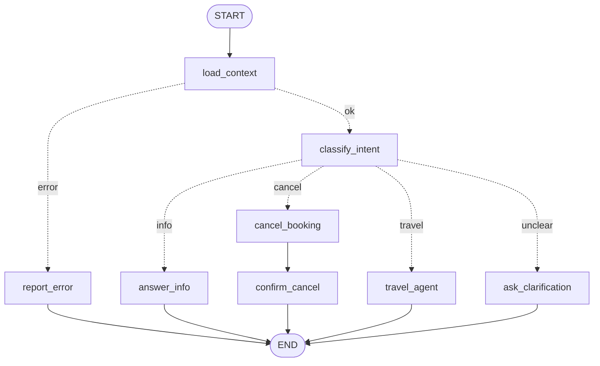

# Create Your First Agent — Flight Assistant (LangGraph + Ollama, Python)

A hands-on exercise: finish a small **flight assistant** built with LangGraph,
running on a **local LLM** (Ollama). It talks to the mock flight server in
[`../server`](../server) to show bookings, cancel them, and search/book/change flights.

This is the Python sibling of `../typescript-agent` — same graph, same tasks,
same tests, same git-branch structure, ported to idiomatic Python
(`langchain`, `langgraph`, `langchain-ollama`, `pytest`).

Some parts are already implemented (✅ **GIVEN**); others are left for you
(🔲 **TODO**). Every TODO has a working "sibling" next to it that you can copy from.

## What you'll learn

| Concept | Where to look |
|---|---|
| **State** — shared data flowing through the graph | `src/flight_assistant/state.py` |
| **Node** — one step: `(state) -> partial update` | `src/flight_assistant/nodes.py` |
| **Edge** — "after A, always go to B" | `builder.add_edge(...)` in `src/flight_assistant/graph.py` |
| **Conditional edge** — "after A, a function decides" | `builder.add_conditional_edges(...)` in `graph.py` + `src/flight_assistant/edges.py` |
| **Graph** — build and compile | `build_graph()` in `graph.py`, `python -m flight_assistant.draw` |
| **Local LLM via Ollama** | `src/flight_assistant/llm.py` — `ChatOllama(model="gemma3:270m")` |
| **Invoking the LLM directly** | `classify_intent`, `answer_info`, `cancel_booking` — `llm.invoke(...)`, `llm.with_structured_output(...)` |
| **Tools** | `src/flight_assistant/tools.py` — `@tool("name", args_schema=...)` |
| **`create_agent`** — the LLM decides which tools to call | `travel_agent` in `nodes.py` |
| **Human-in-the-loop** (TODO 4) — `interrupt()` + checkpointer | `approval.py`, `graph.py`, `run.py` |
| **Human-in-the-loop for agents** (TODO 5) — `HumanInTheLoopMiddleware` | `interrupt_on` in `tools.py`, `travel_agent` |
| **Threads / short-term memory** — one `thread_id` per chat session | `main.py`, `state.py` |

## The graph (when finished)



Solid arrows are **edges**, dotted arrows are **conditional edges**.

| Node | Kind | Status |
|---|---|---|
| `load_context` | Plain code: `GET /user` → `state["user"]` | ✅ GIVEN |
| `report_error` / `ask_clarification` | Plain code: fixed reply | ✅ GIVEN |
| `classify_intent` | Direct LLM call with **structured output** → `state["intent"]` | ✅ GIVEN |
| `answer_info` | Direct LLM call: `llm.invoke(...)` | 🔲 TODO 2 |
| `cancel_booking` | **Fixed workflow**, step 1: LLM extracts the PNR → `state["pnr_code"]` | 🔲 TODO 3 |
| `confirm_cancel` | **Fixed workflow**, step 2: code asks for approval, then `POST /cancel` | 🔲 TODO 3 |
| `travel_agent` | **Agent** (`create_agent`) with tools + `HumanInTheLoopMiddleware` | 🔲 TODO 5 (together with its `cancel_pnr` tool) |

### Calling the LLM directly vs. `create_agent`

* **Direct call** (`cancel_booking` → `confirm_cancel`): *you* write the steps — extract
  the PNR → ask for approval → `POST /cancel` → reply. Predictable, cheap, easy to test.
  The LLM only fills in one blank.
* **`create_agent`** (`travel_agent`): *the LLM* writes the steps. For "move ABC123 to
  the cheapest flight next week" it calls `list_flights`, compares prices, calls
  `change_booking`, then explains the result. Flexible, but less predictable and
  slower (several LLM calls).

Rule of thumb: if you can draw the flowchart, use nodes and edges. If the steps depend
on what the model finds along the way, use an agent.

### Human-in-the-loop: what happens on resume

`interrupt()` pauses the graph. When you answer, LangGraph **re-runs the paused node from
its first line**, and this time `interrupt()` returns your answer. So code before an
interrupt must be safe to repeat: no LLM calls (they may answer differently and e.g. pick
another booking than the one you approved), no API calls. That's why cancelling is split
into two nodes: `cancel_booking` (LLM) → `confirm_cancel` (ask + act).

The travel agent uses LangChain's `HumanInTheLoopMiddleware` instead: it pauses after the
LLM chose its tool calls and **before** any of them runs, and asks about each money-moving
call separately (`interrupt_on` in `src/flight_assistant/tools.py`). If you reject any of
them, none of that step's calls run; the model sees the rejection and plans again.

### Conversation memory

The interactive chat uses one `thread_id` for the whole session, so `messages` holds the
conversation and nodes pass it to the LLM: "What are my bookings?" followed by "Cancel it"
works. The state is kept by the checkpointer (in memory), so memory starts working once
TODO 4 is done and is gone when the process exits.

## Setup

1. **Ollama** — install from <https://ollama.com>, then:
   ```bash
   ollama pull gemma3:270m      # any tool-calling model works: OLLAMA_MODEL=llama3.1:8b python -m flight_assistant.main
   ollama serve                 # skip if the Ollama app is already running
   ```
2. **Flight server** (keep it running in its own terminal — this is the same server
   used by `../typescript-agent`, it is not reimplemented here):
   ```bash
   cd ../server && npm start   # http://localhost:3000 — restart to reset balance/bookings
   ```
3. **This project**:
   ```bash
   python3 -m venv .venv && source .venv/bin/activate
   pip install -e ".[dev]"
   python -m flight_assistant.main "What are my bookings?"
   ```

Useful environment variables: `OLLAMA_MODEL` (default `gemma3:270m`) and
`FLIGHT_API_URL` (default `http://localhost:3000`).

## Your tasks

Do them in order: TODO 1 makes the other nodes reachable. Search the code for `🔲 TODO`.
Each TODO comment has step-by-step hints, points you to a ✅ GIVEN example (👀), and
tells you which test to run (✅ Check).

| # | Task | File(s) | Concept | Check |
|---|---|---|---|---|
| 1 | `route_by_intent` + register the nodes and wire the edges | `src/flight_assistant/edges.py`, `graph.py` | Node, edge, conditional edge | `pytest tests/unit/test_1_*` |
| 2 | `answer_info` node | `src/flight_assistant/nodes.py` | Invoking the LLM directly | `pytest tests/unit/test_2_*` |
| 3 | `cancel_booking` + `confirm_cancel` nodes | `src/flight_assistant/nodes.py` | Structured output + API call = workflow | `pytest tests/unit/test_3_*` |
| 4 | Ask a human before spending money | `src/flight_assistant/approval.py`, `graph.py` | `interrupt()`, checkpointer | `pytest tests/unit/test_4_*` |
| 5 | `cancel_pnr` tool + `travel_agent` node | `src/flight_assistant/tools.py`, `nodes.py` | Tools, `create_agent`, `HumanInTheLoopMiddleware` | `pytest tests/unit/test_5_*` |

Things to try once it works:

```bash
python -m flight_assistant.main "What is my balance and which bookings do I have?"   # info    -> answer_info
python -m flight_assistant.main "Please cancel my October 22 flight"                 # cancel  -> cancel_booking
python -m flight_assistant.main "Book the cheapest flight between Oct 12 and Oct 16"  # travel  -> travel_agent
python -m flight_assistant.main "Move ABC123 to the evening flight on October 27"     # travel  -> travel_agent
python -m flight_assistant.main "Hi!"                                                 # unclear -> ask_clarification
python -m flight_assistant.main                                                       # interactive chat
                                                                                      #   try: "What are my bookings?" -> "Cancel it"
```

Every run prints the nodes it passed through (`-> classify_intent intent=travel`), so
you can follow the graph.

## Commands

| Command | What it does |
|---|---|
| `python -m flight_assistant.main "<question>"` | Run the graph once (no argument = interactive chat) |
| `python -m flight_assistant.draw` | Print the graph as Mermaid (paste into <https://mermaid.live>) |
| `pytest tests/unit` | Fast unit tests: LLM mocked, no server needed |
| `RUN_INTEGRATION_TESTS=1 pytest tests/integration` | End-to-end: real Ollama + a fresh flight server started on port 3999 |

On `main`, `pytest tests/unit` fails until the TODOs are done. That's expected: the
failing tests are your checklist.

## Reference solutions (git branches)

There is one branch per task, so you can peek at one answer without seeing the others:

| Branch | Solves |
|---|---|
| `solutions/todo-1` | TODO 1 |
| `solutions/todo-2` | TODO 2 |
| `solutions/todo-3` | TODO 3 |
| `solutions/todo-4` | TODO 4 |
| `solutions/todo-5` | TODO 5 |
| `solutions/all` | Everything |

```bash
git diff main solutions/todo-2          # see just one solution
git checkout solutions/all              # run the finished assistant
```

## Project layout

```
src/flight_assistant/
  state.py       graph state (TypedDict), incl. pnr_code
  nodes.py       the nodes                         ← TODO 2, 3, 5
  edges.py       routing functions                 ← TODO 1
  graph.py       nodes + edges -> compiled graph    ← TODO 1, 4
  tools.py       tools + approval rules (interrupt_on) for the travel agent  ← TODO 5
  approval.py    human-in-the-loop helper           ← TODO 4
  llm.py         ChatOllama instance
  api.py         requests client for ../server
  context.py     turns data into prompt text
  run.py         streams a run, handles interrupts
  main.py        CLI entry point
  draw.py        prints the graph as Mermaid
tests/unit/          one test file per task
tests/integration/   end-to-end with the real model
```

## Notes on the port

This is a direct, idiomatic Python port of `../typescript-agent`. A few things were
deliberately **not** carried over because they don't have a natural Python equivalent
for this kind of training repo:
- No `npm run typecheck`-style step — the exercise doesn't add a separate static type
  checker (e.g. mypy); Python's own duck typing plus `TypedDict`/pydantic models cover
  the teaching goal of "state/schema shape" without an extra tool to configure.
- The flight API server itself (`../server`) is **reused as-is** (Node), not
  reimplemented in Python — this project is only the LangGraph agent side.
